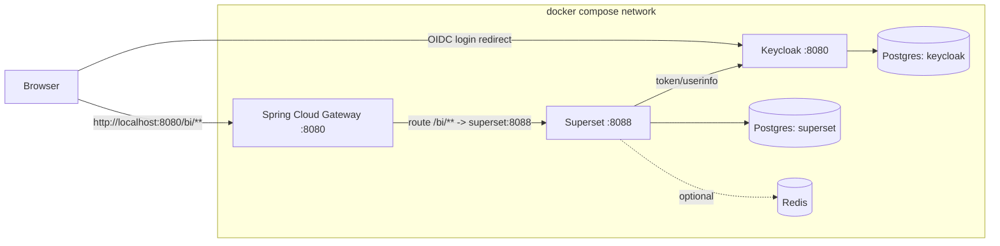
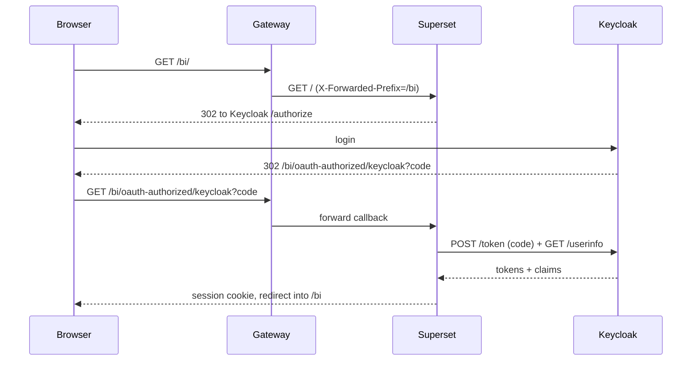

# Architecture Plan — Superset behind a Spring Cloud Gateway with Keycloak SSO

Status: Implemented (branch `feature/compose-gateway-keycloak`)
Last updated: 2026-07-31
Owner: (assign)

## Decisions (resolved §11)

1. Keycloak on `:8081` + Superset `extra_hosts: localhost:host-gateway` (preferred §6).
2. Single shared Postgres with two databases.
3. Pin `apache/superset:6.1.0` (newest release as of 2026-05).
4. Redis/Celery deferred.
5. Self-register as `Gamma`; claim mapping only (no Keycloak role sync yet).

## 1. Goal

Stand up a single `docker compose` stack that serves **Apache Superset** to end users
**through a Spring Cloud Gateway** under the URL prefix **`/bi`**, with **Keycloak**
providing OpenID Connect (OIDC) single sign-on for Superset, and a dedicated
**PostgreSQL** database for Superset's metadata.

Target external entry point:

```
http://localhost:8080/bi/           -> Superset UI (via gateway)
http://localhost:8080/bi/oauth-authorized/keycloak  -> OAuth callback
```

## 2. Components

| Component | Image (proposed) | Internal port | Role |
|-----------|------------------|---------------|------|
| Gateway | `vulhub/spring-cloud-gateway:3.1.0` (see §8 security note) | 8080 | Single ingress; routes `/bi/**` to Superset |
| Superset | `apache/superset:latest` (pin a version, e.g. `4.1.x`/`5.x`) | 8088 | BI web app |
| Keycloak | `quay.io/keycloak/keycloak:<pin>` | 8080 | OIDC identity provider |
| Superset DB | `postgres:16` | 5432 | Superset metadata store |
| Keycloak DB | `postgres:16` (separate db or separate service) | 5432 | Keycloak store |
| (optional) Redis | `redis:7` | 6379 | Superset cache / Celery results |

> Note: the `vulhub/spring-cloud-gateway:3.1.0` image is Spring Cloud Gateway **3.1.0**
> (Spring Boot 2.x). Route config uses the `spring.cloud.gateway.routes` property path
> (NOT the newer `spring.cloud.gateway.server.webflux.routes` used in 4.x docs).

## 3. High-level topology



## 4. Request & auth flow

1. User hits `http://localhost:8080/bi/`.
2. Gateway matches `Path=/bi/**` and forwards to `http://superset:8088`, adding
   `X-Forwarded-*` headers (including `X-Forwarded-Prefix: /bi`).
3. Superset sees an unauthenticated request and redirects the browser to Keycloak's
   `authorize` endpoint (external Keycloak URL).
4. User authenticates in Keycloak; Keycloak redirects back to
   `http://localhost:8080/bi/oauth-authorized/keycloak?code=...`.
5. Gateway forwards the callback to Superset; Superset exchanges the `code` for tokens
   by calling Keycloak's **token** and **userinfo** endpoints server-to-server.
6. Superset creates/updates the local user (self-registration) and starts a session.



## 5. The `/bi` sub-path problem (most important design decision)

Superset must know it lives under `/bi` so it emits correct asset URLs, redirect URIs,
and cookies. Two viable strategies — **choose one and be consistent**:

### Strategy A (recommended): Superset app root = `/bi`, gateway does NOT strip prefix
- Set `SUPERSET_APP_ROOT=/bi` (and/or `APPLICATION_ROOT="/bi"` in `superset_config.py`).
  When app root != `/`, Superset auto-sets `STATIC_ASSETS_PREFIX` to `/bi`.
- Gateway route keeps the path (`Path=/bi/**`, no `StripPrefix`) so Superset receives
  `/bi/...` exactly as it expects.
- Set `ENABLE_PROXY_FIX = True` so `X-Forwarded-*` headers are honored.

### Strategy B: Superset at root, gateway strips `/bi` + forwards prefix header
- Gateway uses `StripPrefix=1` and injects `X-Forwarded-Prefix: /bi`.
- Superset stays at `/`, relies on `ENABLE_PROXY_FIX = True` with
  `PROXY_FIX_CONFIG` `x_prefix=1` (default) to reconstruct external URLs.
- More fragile for static assets/redirects than Strategy A.

Superset defaults gathered from source:
```python
ENABLE_PROXY_FIX = False   # must set True
PROXY_FIX_CONFIG = {"x_for": 1, "x_proto": 1, "x_host": 1, "x_port": 1, "x_prefix": 1}
STATIC_ASSETS_PREFIX = ""  # auto-set to APPLICATION_ROOT when app_root != "/"
```

This plan proceeds with **Strategy A**.

## 6. Keycloak "two URLs" gotcha (must solve or SSO breaks)

The browser and the Superset container reach Keycloak differently:
- Browser needs an **externally reachable** Keycloak URL for `authorize`/redirects.
- Superset (inside the network) needs a URL it can reach for `token`/`userinfo`.

If the OIDC **issuer** in the discovered tokens does not match the URL Superset uses,
token validation fails. Recommended resolution (pick one):

- **Preferred:** make one Keycloak URL work from both sides. Publish Keycloak on the
  host (e.g. `http://localhost:8081`) and add an `extra_hosts`/alias so the Superset
  container resolves the *same* hostname to the Keycloak container. Set Keycloak
  `KC_HOSTNAME`/`KC_HOSTNAME_URL` to that single external URL.
- **Alternative:** route Keycloak through the same gateway (e.g. `/auth/**` -> keycloak)
  so there is a single origin `http://localhost:8080` for both Superset and Keycloak.

Document the chosen Keycloak URL in one place and reuse it in both the Superset OAuth
config and the Keycloak client's valid redirect URIs.

## 7. Configuration artifacts to create

Proposed repo layout:

```
.
├── docker-compose.yml
├── .env                          # secrets & shared values (gitignored)
├── gateway/
│   └── application.yml           # SCG routes (or SPRING_APPLICATION_JSON in compose)
├── superset/
│   ├── superset_config.py        # OAuth + app root + proxy fix
│   └── bootstrap.sh              # db upgrade, admin, init (optional)
├── keycloak/
│   └── realm-export.json         # realm + superset client (import on start)
└── db/
    └── init-multiple-dbs.sh      # create superset + keycloak databases
```

### 7.1 Gateway route (Spring Cloud Gateway 3.1.0 syntax)
```yaml
spring:
  cloud:
    gateway:
      routes:
        - id: superset-bi
          uri: http://superset:8088
          predicates:
            - Path=/bi/**
          filters:
            - PreserveHostHeader
            # Strategy A: do NOT strip prefix; Superset app root is /bi
            # Strategy B alternative: - StripPrefix=1
```
> For the vulhub image (a prebuilt fat jar) prefer injecting this via
> `SPRING_APPLICATION_JSON` env or mounting an `application.yml` and pointing
> `SPRING_CONFIG_ADDITIONAL_LOCATION` at it, since we don't control its build.
> The gateway must forward `X-Forwarded-Prefix: /bi` (SCG sets `X-Forwarded-*` by
> default via the ForwardedHeaders/XForwarded filter).

### 7.2 Superset `superset_config.py` (sketch)
```python
import os
from flask_appbuilder.security.manager import AUTH_OAUTH

APPLICATION_ROOT = "/bi"
ENABLE_PROXY_FIX = True

AUTH_TYPE = AUTH_OAUTH
AUTH_USER_REGISTRATION = True
AUTH_USER_REGISTRATION_ROLE = "Gamma"   # least-privilege default; tighten later

OAUTH_PROVIDERS = [
    {
        "name": "keycloak",
        "icon": "fa-key",
        "token_key": "access_token",
        "remote_app": {
            "client_id": os.environ["KEYCLOAK_CLIENT_ID"],
            "client_secret": os.environ["KEYCLOAK_CLIENT_SECRET"],
            "server_metadata_url": os.environ["KEYCLOAK_DISCOVERY_URL"],  # .../.well-known/openid-configuration
            "api_base_url": os.environ["KEYCLOAK_API_BASE_URL"],
            "client_kwargs": {"scope": "openid email profile"},
        },
    }
]
```
> A custom `SupersetSecurityManager.oauth_user_info()` override may be needed to map
> Keycloak claims (`preferred_username`, `email`, roles) — Context7 confirms this is the
> standard extension point.

### 7.3 Databases
- One Postgres instance with an init script creating `superset` and `keycloak` DBs,
  or two separate Postgres services. Keep Superset metadata isolated from Keycloak.

## 8. Security considerations (DO NOT SKIP)

- **`vulhub/spring-cloud-gateway:3.1.0` is intentionally vulnerable** to
  **CVE-2022-22947** (SpEL injection via the Actuator Gateway API → RCE). It exists as a
  security-lab image. Acceptable for a local demo/CTF, **not for anything exposed**.
  - Do not expose the gateway port beyond localhost.
  - Ensure `management`/`actuator` gateway endpoints are disabled unless the lab
    explicitly needs them.
  - For a real deployment, replace with a self-built Spring Cloud Gateway image on a
    patched version and remove the actuator route API.
- Superset `SECRET_KEY` must be a strong random value (set via env; never default).
- `AUTH_USER_REGISTRATION_ROLE` should be least-privilege (`Gamma`/`Public`), not `Admin`.
- All secrets (`.env`, client secret, DB passwords) kept out of version control.
- Use `openid email profile` scope only; avoid over-broad scopes.

## 9. Bring-up sequence

1. Start Postgres (superset + keycloak DBs) and wait for healthy.
2. Start Keycloak; import realm + `superset` OIDC client (confidential, redirect URI
   `http://<external>/bi/oauth-authorized/keycloak`).
3. Run Superset init (`superset db upgrade`, create admin, `superset init`).
4. Start Superset with `superset_config.py` mounted.
5. Start Gateway with the `/bi -> superset:8088` route.
6. Verify `http://localhost:8080/bi/health` then full login flow.

Use `depends_on` with healthchecks to enforce ordering.

## 10. Testing / acceptance criteria

- `GET http://localhost:8080/bi/health` returns 200 through the gateway.
- Static assets load under `/bi/static/...` (no root-path 404s).
- Login redirects to Keycloak and back to `/bi`, creating a Superset session.
- A new Keycloak user auto-registers with the least-privilege role.
- Superset metadata persists across `superset` container restart (DB volume).
- Negative: token exchange succeeds (no issuer/hostname mismatch — validates §6).

## 11. Open questions

1. Should Keycloak be exposed directly (`:8081`) or routed through the gateway (`/auth`)?
2. Single shared Postgres (two DBs) or two Postgres services?
3. Which Superset version to pin? (affects app-root beta behavior — it's beta in 4.x/5.x)
4. Is Redis/Celery required now, or defer until async/alerts are needed?
5. Role mapping: map Keycloak roles/groups to Superset roles, or manual assignment?

## 12. TODO (tracked)

- [x] Decide open questions in §11.
- [x] Author `docker-compose.yml` with services + healthchecks + volumes.
- [x] Author `superset/superset_config.py` (+ Keycloak security manager).
- [x] Author gateway route config (`gateway/application.yml`).
- [x] Author `keycloak/realm-export.json` with the `superset` client.
- [x] Author `db/init-multiple-dbs.sh`.
- [x] Add `.env.example` and `.gitignore`.
- [x] Validate the full login flow end-to-end (§10) — run `make up && make verify`.
  Smoke covers `/bi/health`, OIDC discovery/issuer, and `/bi/login/keycloak` → Keycloak authorize.
- [x] Add smoke tests / a `make up && make verify` target.
```
